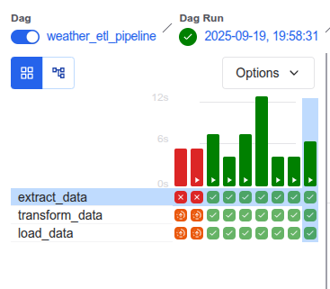
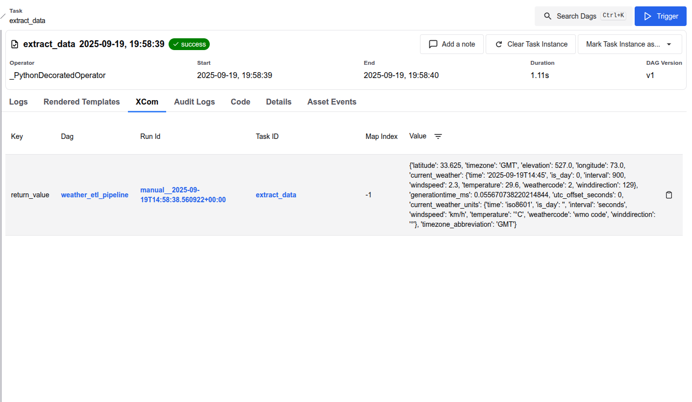
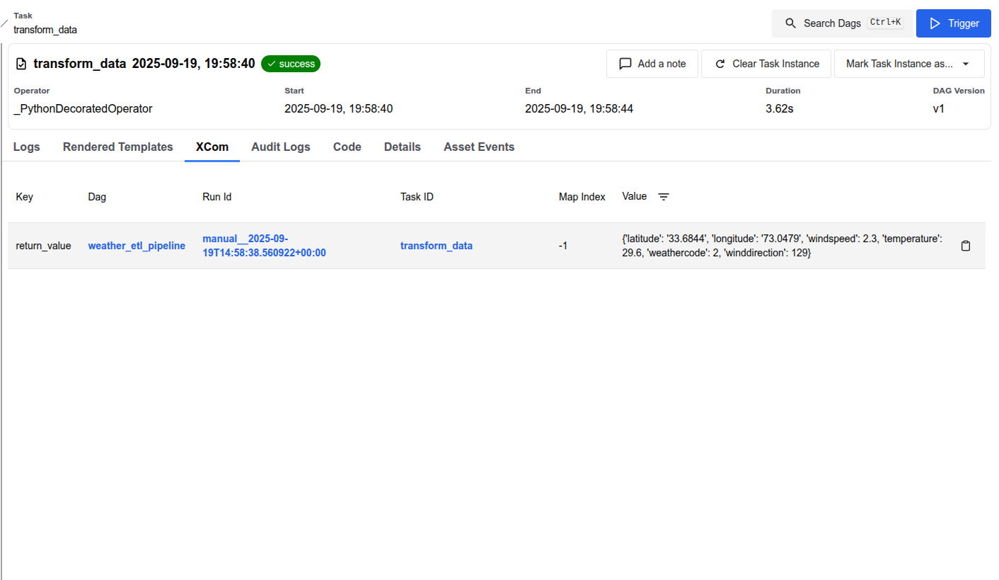
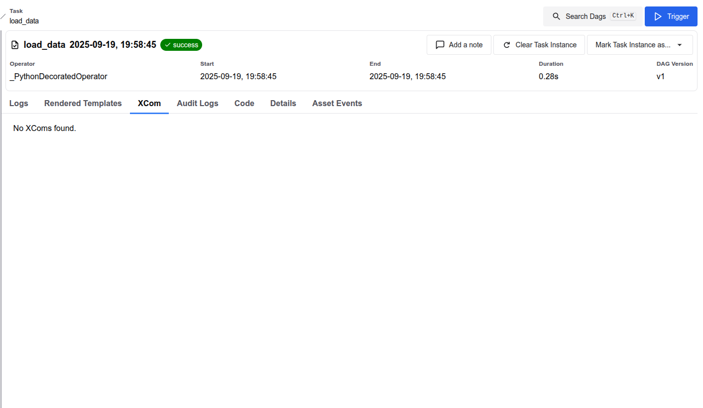
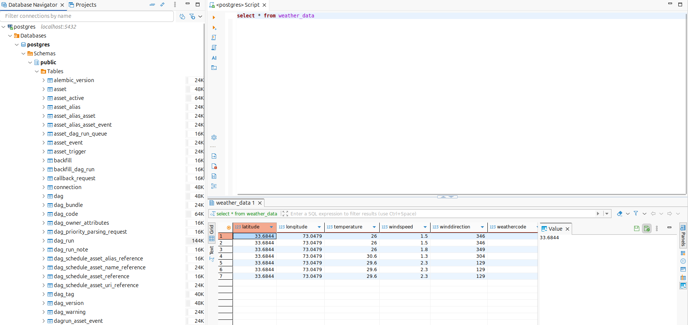

# Weather ETL Pipeline with Airflow, Docker & Postgres

This project demonstrates an **ETL pipeline** built with **Apache Airflow**, **Postgres**, and **Docker**.  
The pipeline extracts real-time weather data from the [Open-Meteo API](https://open-meteo.com), transforms it, and loads it into a **Postgres database** for analysis.  

---

## Tech Stack
- **Airflow** (managed via Astro CLI)  
- **Postgres** (as the database)  
- **Docker & Docker Compose** (for containerization)  
- **DBeaver** (for database visualization)  
- **Python** (ETL logic in DAG)

---

## Project Structure
weather-etl-pipeline 
│── dags 
│ └── weather.py # Main ETL DAG 
│── screenshots # Project screenshots 
│── requirements.txt # Python dependencies 
│── docker-compose.yml # Services setup 
│── README.md # Project documentation

---

## How It Works
1. **Extract** → Weather data is fetched from Open-Meteo API (latitude/longitude for Islamabad).  
2. **Transform** → JSON response is cleaned & converted into structured format.  
3. **Load** → Data is inserted into a Postgres table (`weather_data`).  

---

## Run the Project
1. Clone the repo: 
   git clone https://github.com/your-username/weather-etl-pipeline.git 
   cd weather-etl-pipeline 
   
2. Start Airflow with Astro CLI: 
   astro dev start 
   
3. Access services: 
    Airflow UI → http://localhost:8080 
    Postgres DB → postgresql://localhost:5432/postgres (user: postgres, pass: postgres) 
    Trigger the DAG (weather_etl_pipeline) in Airflow. 

4. Verify results inside DBeaver or with SQL: 
   SELECT * FROM weather_data;

---

## 📸 Screenshots

